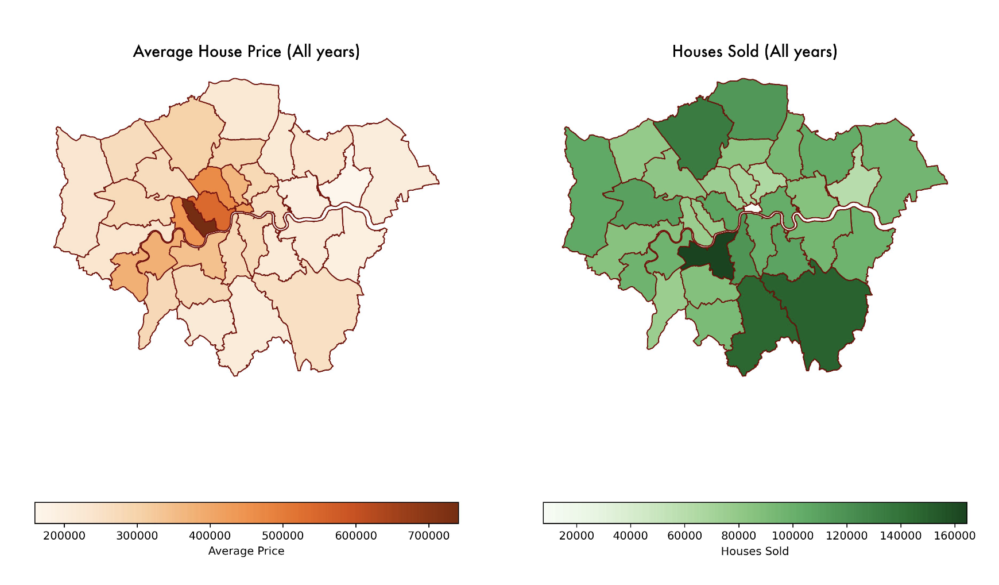

# Predicting London Housing Pricing using ML

## Introduction 

This repository contains code and data files for analyzing London housing data. The data was collected from the London House Prices dataset by Justin Cirtautas, [(check it here!)](https://www.kaggle.com/code/justinas/house-prices-in-london/notebook) and contains information on housing prices, sales, and other related factors. 

## How it works 
I used KNN, RandomForest, and LGBM to develop three different prediction models for London housing data. The KNN model is a non-parametric model that uses nearest neighbors to make predictions, while the RandomForest model uses decision trees and aggregates their results to make predictions. The LGBM model is a gradient boosting model that sequentially adds decision trees to improve the model's accuracy.

To develop these models, I first gathered and cleaned the London housing data. I then split the data into training and testing sets, and used the training set to train each of the models. After training, I used the testing set to evaluate the accuracy of each model.

## Running the code

To ensure that the code runs correctly, it is recommended to set up a virtual Python environment.

You can use the following steps to set up a virtual environment using venv:

1. Open a command prompt or terminal window

2. Navigate to the project directory

3. Run the following command to create a virtual environment:

 

    python3 -m venv housing-project
    
    
4. Activate the virtual environment by running the following command:
 

    source housing-project/bin/activate
    
    
5. Install the required packages by running the following command:

 

    pip install 'package-name'
    
After setting up the virtual environment, you can run the code in the housing.py file using your virtual environment.

# Author
- This repository was created by [Thijs Verreck](https://twitter.com/thijsverreck).
